<h1 align="center">DrawCraft</h1>

<p align="center">
  <b>Vector illustration, reimagined in pure Rust.</b><br>
  A fast, open-source, clean-room take on the Adobe Illustrator workflow — native on macOS, Windows and Linux, and in the browser via WebAssembly.<br>
  <i>By the artcraft team.</i>
</p>

<p align="center">
  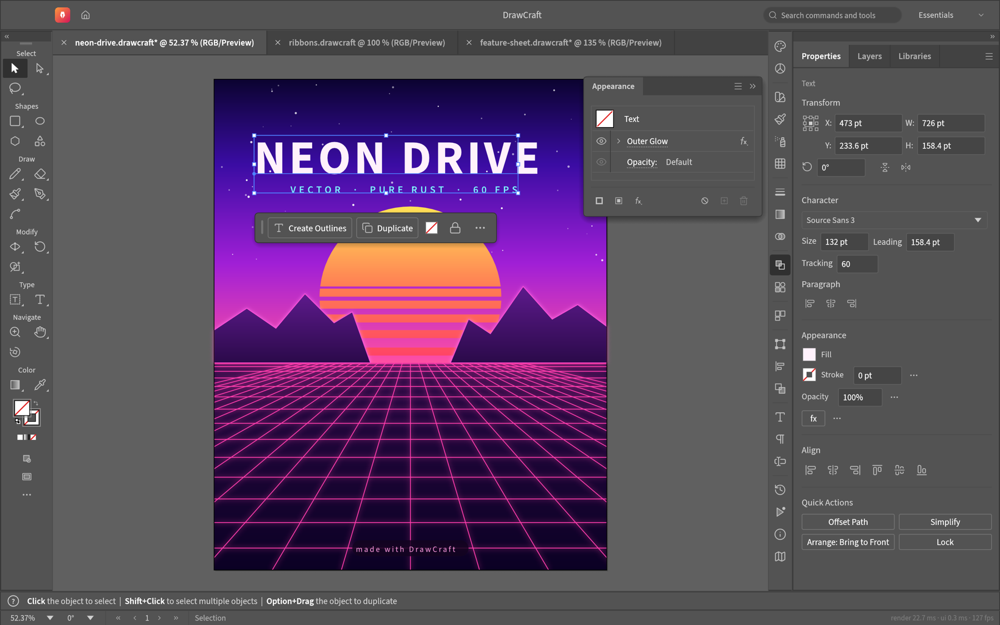
  <br><sub><b>Neon Drive</b> — Pathfinder-cut sun, live Outer Glow on type and grid, clipping masks · <code>examples/neon-drive.drawcraft</code></sub>
</p>

<table>
<tr>
<td width="50%" valign="top">
  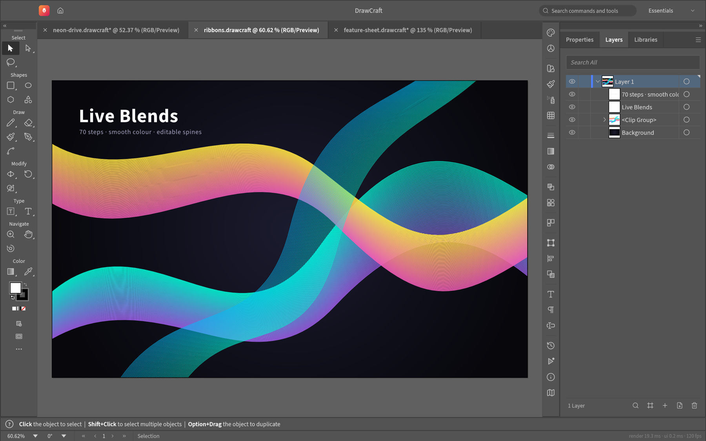
  <p align="center"><sub><b>Live Blends</b> — editable key paths, smooth colour, clipped to the artboard</sub></p>
</td>
<td width="50%" valign="top">
  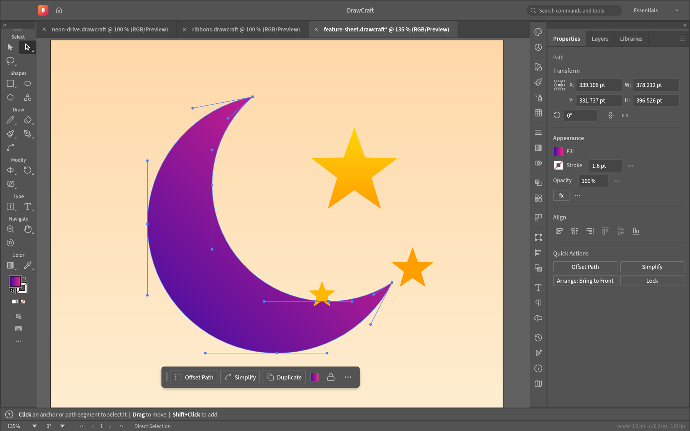
  <p align="center"><sub><b>Pen &amp; Direct Selection</b> — real Bézier anchors and handles, contextual task bar</sub></p>
</td>
</tr>
<tr>
<td colspan="2" valign="top">
  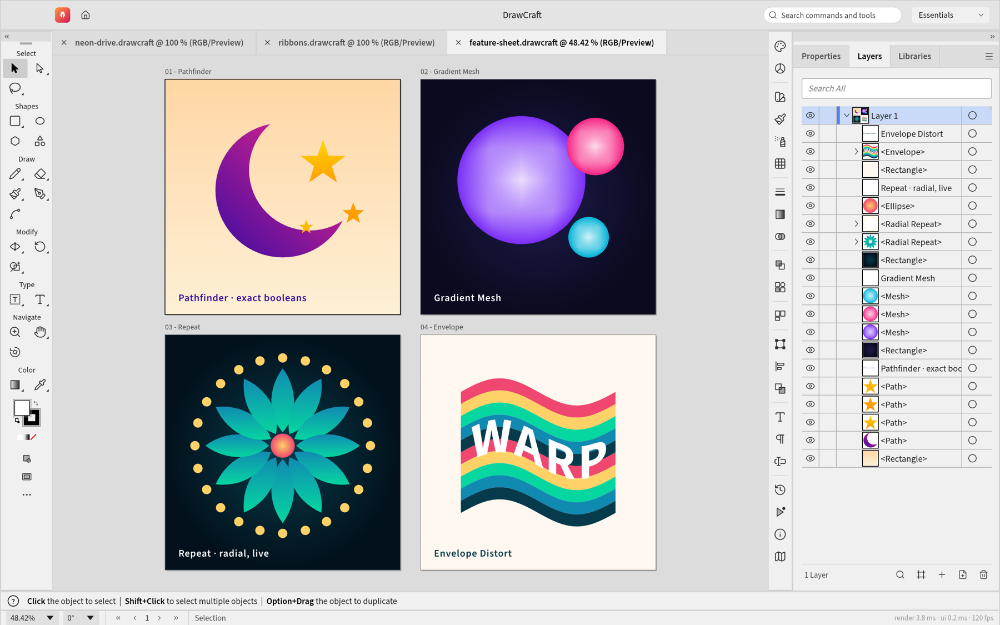
  <p align="center"><sub><b>Multiple artboards, light theme</b> — Pathfinder · Gradient Mesh · live radial Repeat · Envelope Distort · <code>examples/feature-sheet.drawcraft</code></sub></p>
</td>
</tr>
</table>

### Made in DrawCraft

Every piece below was built entirely through DrawCraft's command API, the same one the MCP server exposes to agents, and exported by DrawCraft's own renderer. Source files are in [`examples/`](examples).

<table>
<tr>
  <td width="33%">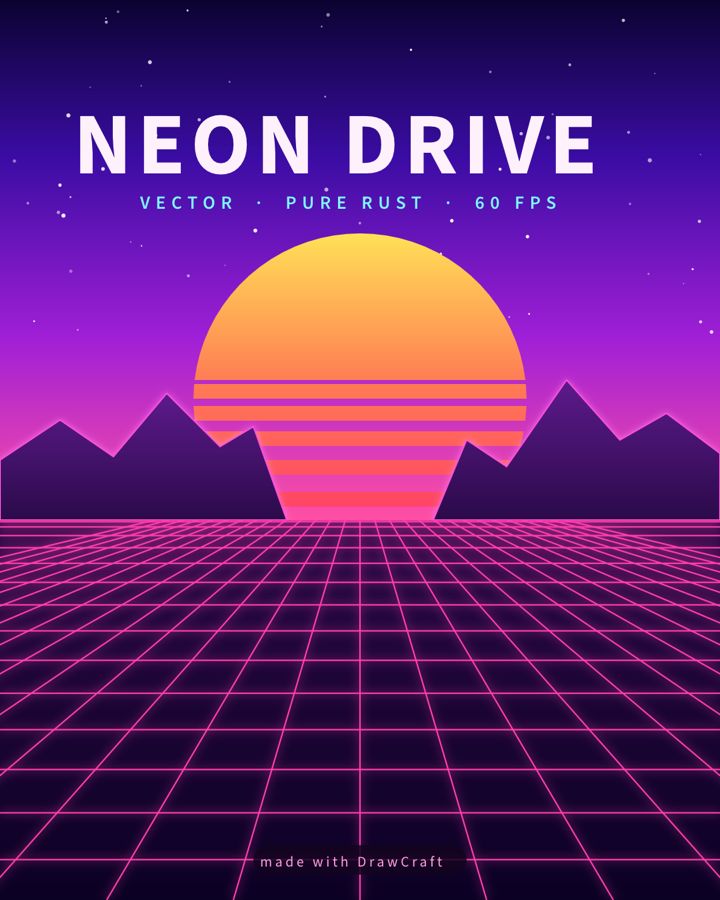</td>
  <td width="33%">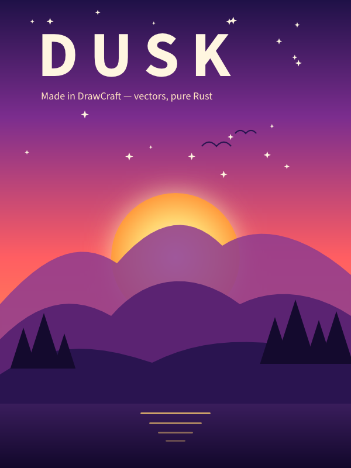</td>
  <td width="33%">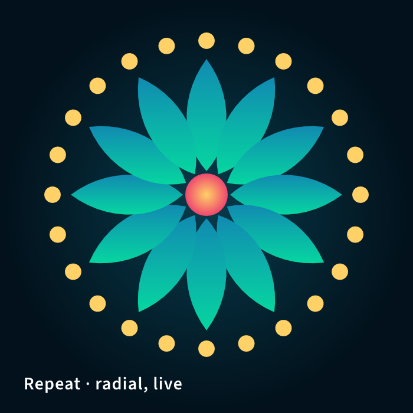<br>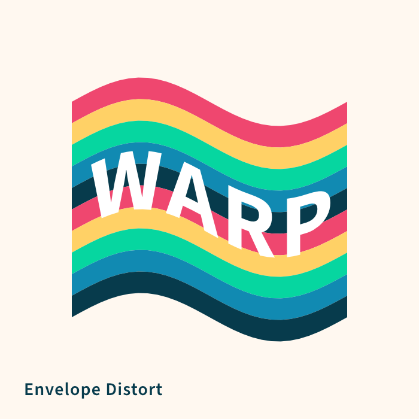</td>
</tr>
<tr>
  <td colspan="2">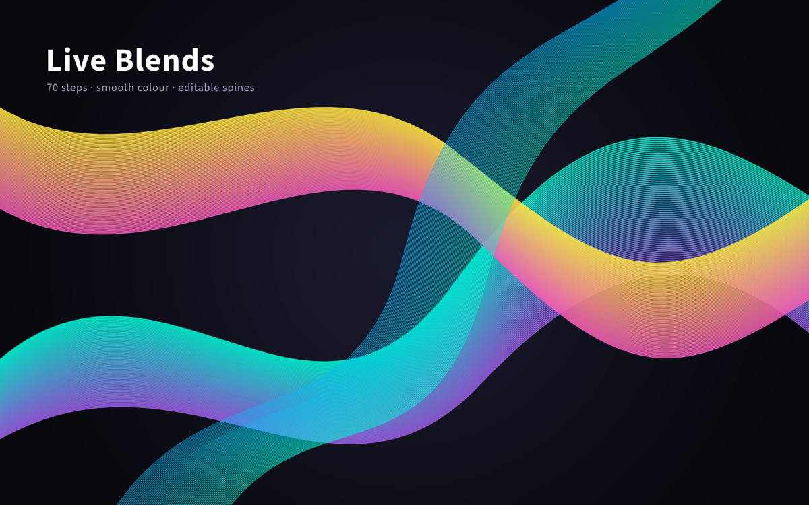</td>
  <td>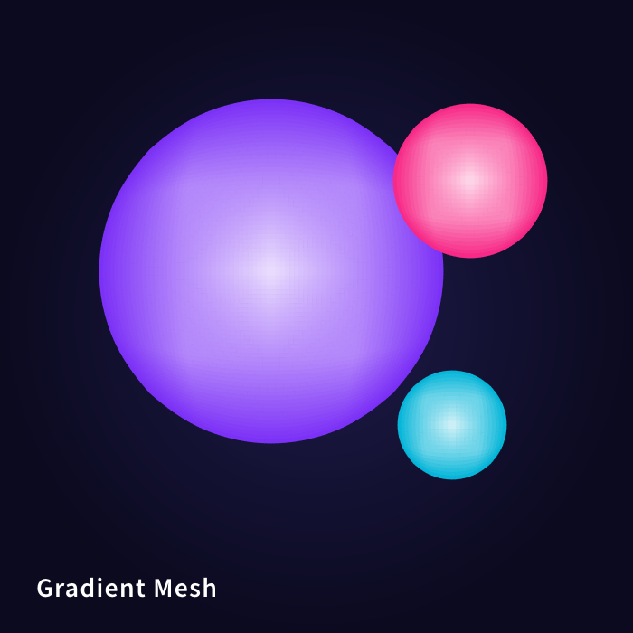<br>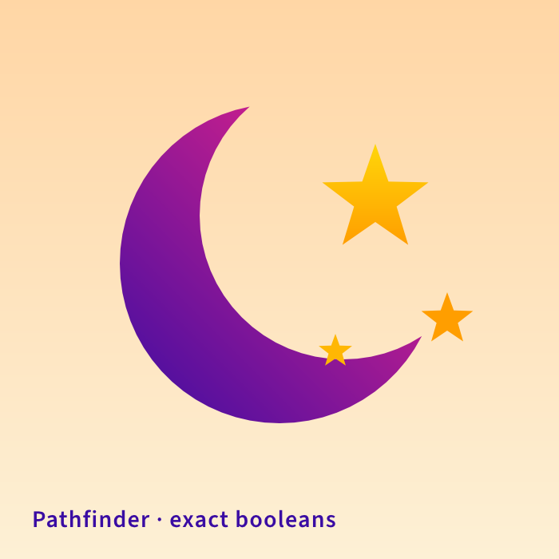</td>
</tr>
</table>

### Why DrawCraft

- **Familiar.** Illustrator's layout, tools, menus, panels and shortcuts — the Pen, Direct Selection, Pathfinder, Smart Guides, Appearance, Swatches, Layers… you already know how to use it.
- **Fast.** Multithreaded SIMD rendering off the UI thread; 20,000 shapes render in ~27 ms at full retina resolution while the interface stays at 120 fps.
- **Robust.** Exact curve booleans (no "cannot perform operation"), unlimited undo via structural sharing, property-tested file round trips.
- **Open.** A documented native format (`.drawcraft`, JSON), first-class SVG, PDF (and PDF-compatible `.ai`) import/export, PNG/JPEG/WebP and Export for Screens.
- **Agent-native.** Every menu item, tool gesture, panel and dialog is drivable over a JSON control channel and an **MCP server** — Claude and other agents can draw, edit and export like a human.
- **Everywhere.** One codebase: desktop apps and the same UI in the browser.

## Quick start

```sh
cargo run --release -p drawcraft                          # desktop app
cargo run --release -p drawcraft -- examples/dusk-poster.drawcraft
cargo run --release -p drawcraft -- --control 7979        # + JSON control channel
cargo run --release -p drawcraft-cli -- mcp               # MCP server (stdio)
cargo xtask bundle                                        # dist/DrawCraft.app (macOS)
cd apps/drawcraft-web && trunk build --release            # web build → dist/web
cargo xtask ci                                            # fmt, clippy, tests, layering, wasm
```

Register with Claude Code: `claude mcp add drawcraft -- /path/to/drawcraft-cli mcp` — see [`docs/mcp.md`](docs/mcp.md) and [`docs/control-protocol.md`](docs/control-protocol.md).

## Status

DrawCraft is under active development. See **[ROADMAP.md](ROADMAP.md)** for what ships today, milestones, and honest time-to-parity estimates.

Workspace: `crates/{geom, color, doc, pathops, text, effects, trace, brush, render, svg, pdf, format, tools, engine, ui-egui, mcp, testkit}`, `apps/{drawcraft, drawcraft-cli, drawcraft-web}`. The egui frontend is a separate crate, so the UI can be swapped without touching the engine. Agent guide: [`CLAUDE.md`](CLAUDE.md).

## Crafting Apps

Open-source, pure-Rust, clean-room creative tools — each engine-first, cross-platform, WASM-ready and fully agent-drivable.

<table>
<tr>
  <td align="center" width="20%"><a href="https://github.com/storytold/photocraft"><b>PhotoCraft</b></a></td>
  <td>Layered raster image editor in the spirit of <b>Photoshop</b> — high-bit-depth pipeline, adjustment layers, brushes, PSD round-trip.</td>
</tr>
<tr>
  <td align="center"><a href="https://github.com/storytold/drawcraft"><b>DrawCraft</b></a></td>
  <td>Vector illustration in the spirit of <b>Illustrator</b> — Pen, Pathfinder, live effects, type, SVG/PDF. <i>(you are here)</i></td>
</tr>
<tr>
  <td align="center"><a href="https://github.com/storytold/filmcraft"><b>FilmCraft</b></a></td>
  <td>Non-linear video editor in the spirit of <b>Premiere Pro</b> — timeline editing, effects, and export.</td>
</tr>
<tr>
  <td align="center"><a href="https://github.com/storytold/lightcraft"><b>LightCraft</b></a></td>
  <td>Photo library and non-destructive raw developer in the spirit of <b>Lightroom</b> — local-first catalog, wide-gamut float pipeline.</td>
</tr>
<tr>
  <td align="center"><a href="https://github.com/storytold/printcraft"><b>PrintCraft</b></a></td>
  <td>PDF viewer and editor in the spirit of <b>Acrobat</b> — rendering, forms, annotations, and document tools.</td>
</tr>
</table>

## License

MIT OR Apache-2.0. Bundled fonts are OFL; Lucide icons are ISC; all other icons and art are original. Per-asset attribution: [`ASSETS.md`](ASSETS.md) (see also [`NOTICE`](NOTICE)).

<sub>DrawCraft is an independent project and is not affiliated with or endorsed by Adobe. "Adobe", "Illustrator", "Photoshop", "Premiere Pro", "Lightroom" and "Acrobat" are trademarks of Adobe Inc., used here only to describe compatibility and workflow familiarity.</sub>
