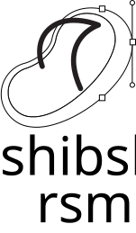

<p align="center">
  <picture>
    <source media="(prefers-color-scheme: dark)" srcset="docs/shibshib/suite/rsm-white.svg">
    
  </picture>
</p>

<h1 align="center">ShibShib rsm</h1>

<p align="center">
  <b>Free, open-source vector illustration — part of the ShibShib creative suite.</b><br>
  <b>رسم متجهي مجاني ومفتوح المصدر — جزء من حزمة شبشب.</b>
</p>

<p align="center">
  
  
</p>

## Built on VectorCraft

ShibShib rsm is a fork of **[VectorCraft](https://github.com/storytold/vectorcraft)**, the open-source,
clean-room vector illustration app written in Rust by the **[ArtCraft](https://getartcraft.com/)** team
and the VectorCraft contributors. Almost everything that makes this app work is their work. Thank you.

If you like ShibShib rsm, please star and support the upstream project as well:
[github.com/storytold/vectorcraft](https://github.com/storytold/vectorcraft) ·
[getartcraft.com/apps](https://getartcraft.com/apps).

ShibShib adds its own branding and, next, a full Arabic and English interface with right-to-left
layout. Our changes are listed in [`shibshib/CHANGES.md`](shibshib/CHANGES.md); we aim to send
improvements that help everyone, such as the Arabic translation, back upstream.

## The ShibShib suite

| App | For | Based on | Status |
|---|---|---|---|
| **ShibShib rsm** | Vector illustration | [VectorCraft](https://github.com/storytold/vectorcraft) | Branded fork |
| ShibShib tlween | Image editing | [PhotoCraft](https://github.com/storytold/photocraft) | Planned |
| ShibShib trteeb | Page layout | [DesignCraft](https://github.com/storytold/designcraft) | Planned (upstream in development) |
| ShibShib tsweer | Video editing | [FilmCraft](https://github.com/storytold/filmcraft) | Planned |
| ShibShib effectat | Motion graphics | [EffectCraft](https://github.com/storytold/effectcraft) | Planned |
| ShibShib 7rrek | Character animation (tweens + frame by frame) | ShibShib rsm | Planned |
| ShibShib sharek | Collaborative design | to be decided | Planned |

## Quick start

Requires a recent stable Rust toolchain.

```sh
cargo run --release -p vectorcraft      # desktop app
cargo xtask bundle                      # macOS app bundle in dist/
cd apps/vectorcraft-web && trunk build --release   # web build
```

Features, file formats, the command API and the MCP server for agents are the same as upstream; see
the [upstream README](https://github.com/storytold/vectorcraft#readme), [`ROADMAP.md`](ROADMAP.md) and
[`docs/`](docs).

## Keeping up with upstream

```sh
git fetch upstream
git merge upstream/main
python3 shibshib/rebrand.py
```

## License and credits

Dual-licensed under [MIT](LICENSE-MIT) or [Apache-2.0](LICENSE-APACHE), at your option, as upstream.
Copyright (c) 2026 ArtCraft Team and the VectorCraft contributors; modifications by the ShibShib
contributors. Required notices are in [NOTICE](NOTICE), and every bundled asset is listed with its
licence in [ASSETS.md](ASSETS.md).

The ShibShib name and logos in [`docs/shibshib/`](docs/shibshib/) belong to the ShibShib project.
ArtCraft and VectorCraft are names of the upstream project, used here only to credit it; ShibShib is
not affiliated with or endorsed by the ArtCraft team.

<sub>Adobe and Illustrator are trademarks or registered trademarks of Adobe Inc. in the United States
and/or other countries. ShibShib is an independent open-source project and is not affiliated with,
sponsored by or endorsed by Adobe Inc.</sub>
